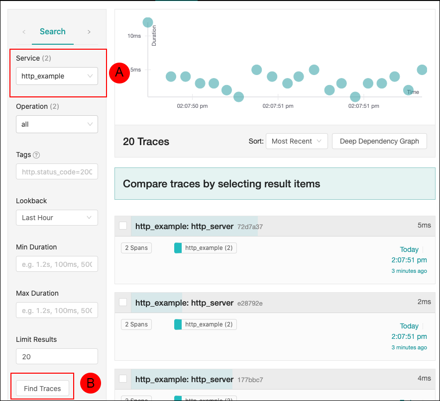

# simpletracing
A simple repo for demonstrating the basic of opentelemetry and service tracing

# Getting the demonstration up and running

If you are not on Katacoda go here:

`https://katacoda.com/courses/ubuntu/playground`

Get the code from GitHub:

`git clone https://github.com/reselbob/simpletracing.git`

`cd simpletracing/`

`docker-compose up`

In a new terminal window, excute the following:

`for i in {1..20}; do curl localhost:4000 -w "\n"; done`

You'll get out put simiar to the following:

```

{"message":"qui assumenda consequatur doloribus autem quisquam voluptas facilis dolores non","created":"2020-09-17T21:07:50.852Z"}
{"message":"voluptas ut aut deleniti consequuntur sit autem animi alias officiis","created":"2020-09-17T21:07:50.875Z"}
{"message":"cum excepturi beatae beatae minima odit sit minima veritatis aut","created":"2020-09-17T21:07:50.892Z"}
{"message":"dolor sit laudantium consectetur aut odio voluptas quo vero sit","created":"2020-09-17T21:07:50.909Z"}
{"message":"aliquid id eum pariatur vero aut alias maiores labore hic","created":"2020-09-17T21:07:50.925Z"}
{"message":"voluptatem consequuntur atque dicta ea et excepturi necessitatibus illum veritatis","created":"2020-09-17T21:07:50.941Z"}
{"message":"quibusdam voluptatum natus sit magni unde velit quis mollitia earum","created":"2020-09-17T21:07:50.954Z"}
{"message":"esse et itaque sit dicta quam esse beatae sapiente repellendus","created":"2020-09-17T21:07:50.975Z"}
{"message":"suscipit aut molestias sit tenetur illum blanditiis nulla dolor deserunt","created":"2020-09-17T21:07:50.993Z"}
{"message":"veniam nam velit minus nesciunt laborum rem fuga quod voluptatibus","created":"2020-09-17T21:07:51.011Z"}
{"message":"voluptatum saepe commodi sequi velit enim quidem delectus consequatur eum","created":"2020-09-17T21:07:51.024Z"}
{"message":"qui asperiores sed rem harum qui non autem reiciendis quis","created":"2020-09-17T21:07:51.042Z"}
{"message":"repudiandae ut voluptatem rerum sed sunt ipsam pariatur adipisci sunt","created":"2020-09-17T21:07:51.060Z"}
{"message":"vero sed alias omnis velit aut veniam quaerat quo et","created":"2020-09-17T21:07:51.075Z"}
{"message":"deserunt numquam modi illo veniam placeat culpa officia aspernatur et","created":"2020-09-17T21:07:51.090Z"}
{"message":"nemo eos quia voluptatem vero sed aperiam delectus quia rerum","created":"2020-09-17T21:07:51.105Z"}
{"message":"dolores tempore alias labore molestiae cupiditate autem aut fugiat rerum","created":"2020-09-17T21:07:51.121Z"}
{"message":"et dolore temporibus cupiditate id ut quibusdam tempora eaque hic","created":"2020-09-17T21:07:51.136Z"}
{"message":"est optio architecto excepturi officia dignissimos saepe vel id quibusdam","created":"2020-09-17T21:07:51.152Z"}
{"message":"consequatur quia et beatae distinctio sunt exercitationem quis sit minima","created":"2020-09-17T21:07:51.168Z"}

```

Open your browser to `http://localhost:16686` to view the Jaeger UI:



In the Jaeger UI, select `http_example` (A) from the Service dropdown on the Search panel on the left, then click the Find Traces (B) button found at the bottom of the Seach panel. SimpleTracing's trace will display in the main, rightside panel.


